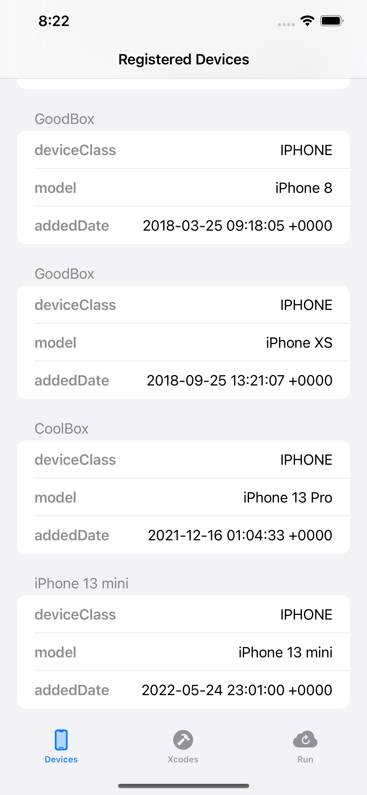
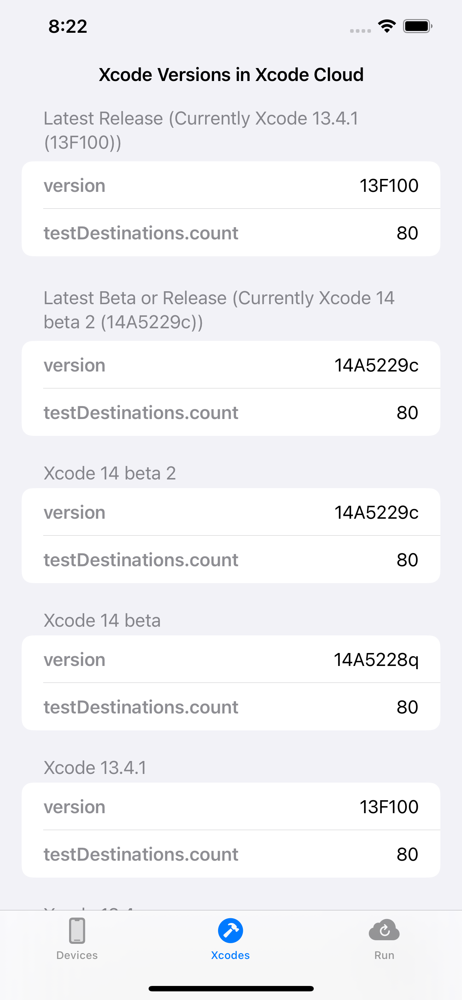
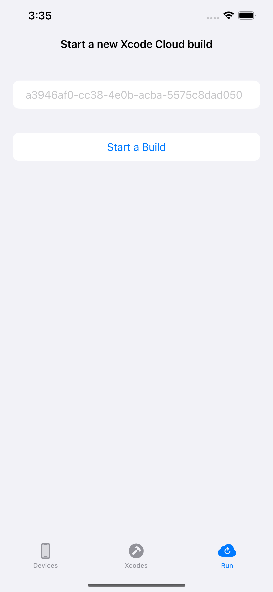

# Example of ASCAPIClient

[ASCAPIClient](https://github.com/hmhv/ASCAPIClient) is a Swift client for App Store Connect API with Swift Concurrency (async/await).

In the Example, I tried 3 API.

- [List Devices](https://developer.apple.com/documentation/appstoreconnectapi/list_devices)
- [List All Xcode Versions Available in Xcode Cloud](https://developer.apple.com/documentation/appstoreconnectapi/list_all_xcode_versions_available_in_xcode_cloud)
- [Start a Build(Start a new Xcode Cloud build for a workflow.)](https://developer.apple.com/documentation/appstoreconnectapi/start_a_build)

## How to build

#### 1. Clone this repository

```bash
git clone git@github.com:hmhv/ASCAPIClient-Example-iOS.git
```

#### 2. Open Xcode Project

```bash
cd ASCAPIClient-Example-iOS
open ASCAPIClient-Example-iOS.xcodeproj
```

#### 3. Reset Package Caches

select `File -> Packages -> Reset Package Caches`

#### 4. Enter your API Keys for App Store Connect API

Read [Creating API Keys for App Store Connect API](https://developer.apple.com/documentation/appstoreconnectapi/creating_api_keys_for_app_store_connect_api), 
and fix [Here](https://github.com/hmhv/ASCAPIClient-Example-iOS/blob/main/ASCAPIClient-Example-iOS/ContentViewModel.swift#L11-L22)

#### 5. Run Project

select `Product -> Run`

## ScreenShots




